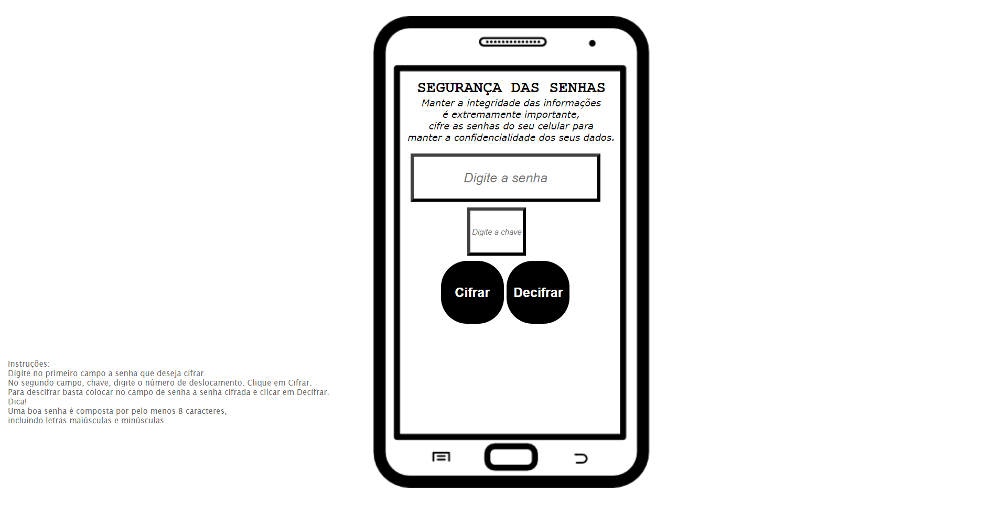

# Cifra de César

## Índice

* [1. Prefácio](#1-prefácio)
* [2. Resumo do projeto](#2-resumo-do-projeto)
* [3. Elaboração](#3-elaboração)
* [4. Design](#4-design)
* [5. Considerações Finais](#5-considerações-finais)

***

## 1. Prefácio

Manter o acesso dos dados disponíveis para somente pessoas autorizadas é extremamente importante, garantindo a confidencialidade das informações. Atualmente o celular carrega muitos dados dos usuários, como fotos pessoais; conversas e ligações; dados bancários; entre diversas coisas que o usuário poderá salvar. Essas informações precisam estar protegidas e para isso a senha para acessar o celular necessita que seja segura, completa e complexa, dificultando o acesso de pessoas indesejáveis.

A cifra de César é uma técnica para cifrar uma mensagem. É um tipo de cifra por substituição, em que cada letra do texto original é substituida por outra que se encontra há um número fixo de posições (deslocamento) mais a frente do mesmo alfabeto.

## 2. Resumo do projeto

A partir da cifra de César criei um produto que codifique as senhas dos usuários de celular, com o objetivo de que o usuário deixe sua senha mais complexa e, portanto, mais segura. Essa aplicação ajudará os usuários que possuem senhas simples e/ou que utilizam nomes de familiares ou seu próprio nome para criação de senhas.

O projeto busca integrar os usuários de celular na utilização de segurança da informação, colocando os em menos risco e salvaguardar seus dados.

## 3. Elaboração

Para elaborar o projeto foi utilizado o HTML para inserção do conteúdo que o usuário irá visualizar. Também foi utilizado dois arquivos JavaScript, um que faz todas as interações com o HTML, como os eventos de cliques dos botões, e outro para colocar as funções de cifra e decifrar, funcionando tanto para letras maiúsculas tanto como para as minúsculas, além de aparecer os números e os caracteres (sem deslocamento). O arquivo em CSS foi utilizado para definir como a aplicação ficará visível para os usuários.

## 4. Design

Foi pensando em simular a tela de um celular, indicando a utilização da aplicação:

## 5. Considerações Finais

O projeto cumpriu os requisitos obrigatórios, portanto, os testes foram realizados e os resultados foram satisfatórios. 